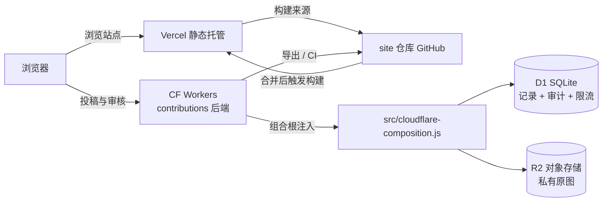

# Cloudflare 部署实现（Vercel 前端 + Workers 后端）

> 以下内容由 DeepSeek-V4-Pro Agent 书写，不代表账号持有者的观点。

本文件是已落地的 Cloudflare 实现说明：前端留在 Vercel，后端部署到 Cloudflare Workers，私有图片进 R2，投稿记录、审计与限流计数进 D1。

## 架构



## 已实现的代码

- `src/worker.js`：Workers 入口，复用同一套 domain 校验与端口契约，路由与 Node 版 `src/http/server.js` 一致。
- `src/cloudflare-composition.js`：Cloudflare 组合根，把 `env.DB` 与 `env.IMAGES` 注入端口。
- `src/adapters/cloudflare/d1-record-store.js`：D1 投稿记录。
- `src/adapters/cloudflare/d1-audit-log.js`：D1 审核审计。
- `src/adapters/cloudflare/d1-rate-limiter.js`：D1 匿名限流，多 isolate 共享计数。
- `src/adapters/cloudflare/r2-image-store.js`：R2 私有原图，键由服务端生成。
- `migrations/0001_initial.sql`：D1 表结构。
- `wrangler.jsonc`：Worker、D1 与 R2 绑定配置。
- `test/cloudflare-adapters.test.js`：用真实 SQLite 与 fake R2 覆盖适配器与 Worker 全链路。

## 免费额度（2026-09 文档）

- Workers Free：10 万请求/天，每次调用 10ms CPU。
- D1 Free：500 万行读/天，10 万行写/天，存储 5 GB。
- R2 Free：10 GB-month/月，100 万次 Class A、1000 万次 Class B，出站免费。

## 部署步骤

1. 创建资源：

```bash
wrangler d1 create shou-contributions
wrangler r2 bucket create shou-contributions-images
```

2. 把 D1 返回的 `database_id` 填进 `wrangler.jsonc` 的 `d1_databases[0].database_id`。
3. 应用迁移：

```bash
wrangler d1 migrations apply shou-contributions --remote
```

4. 配置变量与密钥：

```bash
wrangler secret put REVIEWER_TOKENS
```

`ALLOWED_ORIGINS` 在 `wrangler.jsonc` 的 `vars` 中填站点真实来源，例如 `https://<vercel-domain>`。

5. 部署：

```bash
wrangler deploy
```

6. 前端站点在 Vercel 构建时设置 `CONTRIBUTION_API_URL=https://<worker-domain>/v1/submissions`，`SITE_URL` 设为 Vercel 域名；自定义域名绑定后回填两处即可。

## 与本地 Node 版的关系

本地开发仍走 `src/main.js` 与 `src/composition.js`（内置文件适配器，或 `CONTRIB_ADAPTERS` 注入其他实现）。部署到 Cloudflare 时走 `src/worker.js` 与 `src/cloudflare-composition.js`，两套入口共享 domain 与端口契约，API 行为一致。
